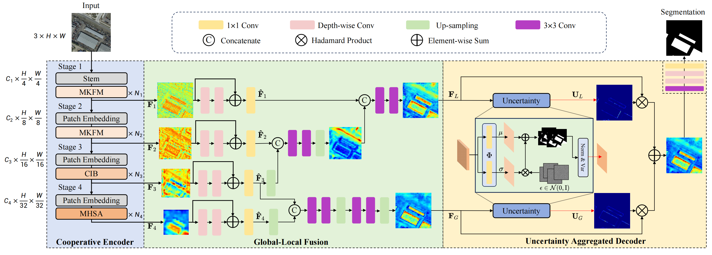

# UAGLNet: Uncertainty-Aggregated Global-Local Fusion Network with Cooperative CNN-Transformer for Building Extraction

[📄[**Paper**](https://To/be/updated)]  &nbsp; [📚[**Arxiv**](https://arxiv.org/abs/2512.12941)]  &nbsp; [🤗[**Hugging Face**](https://huggingface.co/collections/ldxxx/uaglnet)]

🔥 **UAGLNet has been accepted by IEEE TGRS**

We present UAGLNet, which is capable to exploit high-quality global-local visual semantics under the guidance of uncertainty modeling. Specifically, we propose a novel cooperative encoder, which adopts hybrid CNN and transformer layers at different stages to capture the local and global visual semantics, respectively. An intermediate cooperative interaction block (CIB) is designed to narrow the gap between the local and global features when the network becomes deeper. Afterwards, we propose a Global-Local Fusion (GLF) module to complementarily fuse the global and local representations. Moreover, to mitigate the segmentation ambiguity in uncertain regions, we propose an Uncertainty-Aggregated Decoder (UAD) to explicitly estimate the pixel-wise uncertainty to enhance the segmentation accuracy. Extensive experiments demonstrate that our method achieves superior performance to other state-of-the-art methods.



## Quick Start

### Installation

Clone this repository and create the environment.
```bash
git git@github.com:Dstate/UAGLNet.git
cd UAGLNet

conda create -n uaglnet python=3.8 -y
conda activate uaglnet
conda install pytorch==1.10.0 torchvision==0.11.0 torchaudio==0.10.0 cudatoolkit=11.3 -c pytorch -c conda-forge
pip install -r requirements.txt
```

### Data Preprocessing

We conduct experiments on the Inria, WHU, and Massachusetts datasets. Detailed guidance for dataset preprocessing is provided here: [DATA_PREPARATION.md](https://github.com/Dstate/UAGLNet/blob/main/assets/DATA_PREPARATION.md).


### Training & Testing

Training and testing examples on the Inria dataset:
```bash
# training
python UAGLNet_train.py -c config/inria/UAGLNet.py

# testing
python UAGLNet_test.py -c config/inria/UAGLNet.py
```

### Main Results

The following table presents the performance of UAGLNet on building extraction benchmarks.

| **Benchmark** | **IoU** | **F1** | **P** | **R** | **Weight** |
| :-------: | :--------: | :--------: | :-----------: | :------: | :------: |
| Inria | 83.74 | 91.15 | 92.09 | 90.22 | [UAGLNet_Inria](https://huggingface.co/ldxxx/UAGLNet_Inria) |
| Mass | 76.97 | 86.99 | 88.28 | 85.73 | [UAGLNet_Mass](https://huggingface.co/ldxxx/UAGLNet_Massachusetts) |
| WHU | 92.07 | 95.87 | 96.21 | 95.54 | [UAGLNet_WHU](https://huggingface.co/ldxxx/UAGLNet_WHU) |

You can quickly reproduce these results by running `Reproduce.py`, which will load the pretrained checkpoints from Hugging Face and perform inference.

```bash
# Inria
python Reproduce.py -d Inria

# Massachusetts
python Reproduce.py -d Mass

# WHU
python Reproduce.py -d WHU
```

## Citation
If you find this project useful in your research, please cite it as:
```
@article{UAGLNet,
  title   = {UAGLNet: Uncertainty-Aggregated Global-Local Fusion Network with Cooperative CNN-Transformer for Building Extraction}, 
  author  = {Siyuan Yao and Dongxiu Liu and Taotao Li and Shengjie Li and Wenqi Ren and Xiaochun Cao},
  journal = {arXiv preprint arXiv:2512.12941},
  year    = {2025}
}
```

## Acknowledgement
This work is built upon [BuildingExtraction](https://github.com/stdcoutzrh/BuildingExtraction), [GeoSeg](https://github.com/WangLibo1995/GeoSeg/tree/main) and [SMT](https://github.com/AFeng-x/SMT). We sincerely appreciate their contributions which provide a clear pipeline and well-organized code.

## License
This project is licensed under the [Apache License 2.0](LICENSE).
